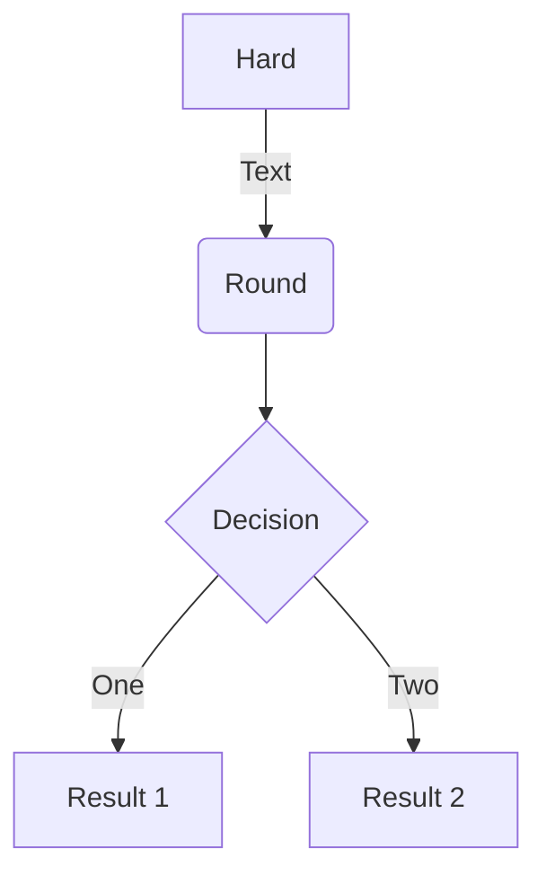

# 見出し 1

## 見出し 2

### 見出し 3

#### 見出し 4

##### 見出し 5

###### 見出し 6

- リスト 1
    - ネスト リスト 1_1
        - ネスト リスト 1_1_1
        - ネスト リスト 1_1_2
    - ネスト リスト 1_2
- リスト 2
- リスト 3

---

1. 番号付きリスト 1
    1. 番号付きリスト 1_1
    1. 番号付きリスト 1_2
1. 番号付きリスト 2
1. 番号付きリスト 3

---

> お世話になります。xxx です。
>
> ご連絡いただいた、バグの件ですが、仕様です。

---

```py3
import foo
import boo.baz
import foo.bar.baz

class Foo:
  def __init__(self):
      self.foo = None
      self.bar = None
      self.baz = None
```

normal _italic_ normal

normal **bold** normal

| header1    |     header2 |   header3    |
| :--------- | ----------: | :----------: |
| align left | align right | align center |
| a          |           b |      c       |

[Google 先生](https://www.google.co.jp/)

??? success
    Content.

??? warning classes
    Content.

あいうえお[^1]

[^1]: ふぉお

Apple
:   Pomaceous fruit of plants of the genus Malus in
    the family Rosaceae.

Orange
:   The fruit of an evergreen tree of the genus Citrus.



$$
x + y = z
$$

$$
E(\mathbf{v}, \mathbf{h}) = -\sum_{i,j}w_{ij}v_i h_j - \sum_i b_i v_i - \sum_j c_j h_j
$$

\[3 < 4\]

\begin{align}
p(v*i=1|\mathbf{h}) & = \sigma\left(\sum_j w*{ij}h*j + b_i\right) \\
p(h_j=1|\mathbf{v}) & = \sigma\left(\sum_i w*{ij}v_i + c_j\right)
\end{align}

@facelessuser/pymdown-extensions


🦐